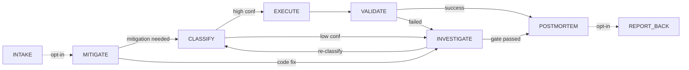

# incident-analysis

A structured, tiered investigation engine for **production incidents** on GCP. It takes you
from a raw symptom ("checkout is throwing 500s") to a safety-gated mitigation and a written
postmortem — enforcing evidence discipline at every step so you don't confidently ship the
wrong root cause.

There is no orchestrator binary. `SKILL.md` **is** the program: a prompt-driven state machine
the model executes. The only runnable pieces are `scripts/redact-evidence.sh` (secret/PII
scrubbing) and the shared `scripts/obs-preflight.sh` it calls to detect tools.

---

## When it fires

The router activates this skill on production-symptom language:

- Connection failures, pod crashes / restarts, `CrashLoopBackOff`
- `SIGTERM` / OOM / exit-code errors, `ImagePullBackOff`, `CreateContainerConfigError`
- Latency spikes, Cloud SQL / proxy issues, deployment-correlated error spikes
- Node `NotReady` events

`/investigate` is the explicit entry point.

**When it does _not_ fire (by design):**

| Situation | Use instead |
|-----------|-------------|
| Local dev / CI failures | `systematic-debugging` |
| Alert tuning / flapping alerts | `alert-hygiene` |
| Capacity planning without an active incident | proactive monitoring |
| Perf optimization with no user-facing symptom | not an incident |

---

## The tiered tool model

Everything degrades gracefully across three tiers, detected at runtime by
`obs-preflight.sh`. The skill **probes auth before trusting Tier 1** and actively offers to
re-authenticate rather than silently downgrade — because a silent fallback to Tier 2 hides
exactly the metrics (DB connection counts, traces) that crack shared-resource incidents.

| Tier | Backend | Capabilities | Missing |
|------|---------|--------------|---------|
| **1** | GCP Observability MCP | logs, **metrics** (`list_time_series`), **trace correlation** (`get_trace`), error-signature grouping (`list_group_stats`) | — |
| **2** | `gcloud` CLI | logs, client-side error bucketing | no metrics, no traces |
| **3** | guidance-only | Cloud Console URLs + filter syntax | everything automated |

Tier 2 uses a `mktemp` temp-file pattern for any non-trivial LQL query, so shell-escaping and
concurrent-session races can't corrupt the filter.

---

## The stage pipeline



| Stage | Role |
|-------|------|
| **INTAKE** / **REPORT-BACK** | opt-in Jira bookends; skipped unless you name a ticket |
| **MITIGATE** (Stage 1) | triage core: detect tier → access gate → scope/inventory/impact → query errors → route |
| **CLASSIFY** | score evidence against playbooks, confidence-gate the route |
| **INVESTIGATE** (Stage 2) | deep dive: single- & multi-service sweeps, trace correlation, source analysis, hypothesis with contradiction tests |
| **EXECUTE → VALIDATE** | apply approved playbook command after a fingerprint recheck, then confirm it worked |
| **POSTMORTEM** (Stage 3) | write a structured doc to `docs/postmortems/` |

Two **re-entry loops** matter: a low-confidence CLASSIFY drops to INVESTIGATE Steps 1–5 only
(then re-classifies); a **failed** VALIDATE drops to the _full_ Stage 2.

### Two investigation modes

- **Full investigation** (default) — the complete pipeline, every step in order.
- **Live triage** (opt-in — "quick triage", "what's happening right now") — defers deep
  inventory and impact quantification to prioritize time-to-first-hypothesis. Safety rails
  never relax: access state is still recorded, the EXECUTE fingerprint recheck and HITL gate
  are never skipped, and deferred steps get flagged as gaps if never backfilled. The mode is
  recorded in `investigation_summary.scope.mode`.

---

## Deep dive 1 — CLASSIFY scoring

CLASSIFY turns collected evidence into a ranked playbook decision. It loads candidate
playbooks (bundled `playbooks/*.yaml` + repo-local `playbooks/incident-analysis/*.yaml`,
resolved by `id`), evaluates each referenced signal to a tri-state
(`detected` / `not_detected` / `unknown_unavailable`), then scores.

**The math, per playbook:**

1. **Veto** — any `veto_signal` in state `detected` → disqualified outright.
2. **Coverage gate** — `evaluable_weight / max_possible ≥ 0.70`, else ineligible to propose
   (still shown in the summary).
3. **Score:**
   ```
   base_score          = Σ weight of supporting signals that are `detected`
   contradiction_score = contradiction_penalty × count(contradicting signals `detected`)
   raw_score           = base_score − contradiction_score
   confidence          = clamp(0,100, round(raw_score / evaluable_weight × 100))
   ```
   Note the denominator is **evaluable_weight**, not `max_possible` — unknown signals are
   excluded from scoring, not counted against the playbook.

**Confidence-gated routing:**

| Confidence | Route |
|-----------|-------|
| **≥ 85** (with ≥ 15pt margin over the top incompatible runner-up, exactly one eligible) | → **HITL gate**: present the high-confidence decision record + exact command; wait for approval |
| **60–84** | → **disambiguation probes**: run one read-only probe per runner-up, recompute, re-rank. No command shown |
| **< 60** | → **INVESTIGATE Steps 1–5**, then feed findings back to CLASSIFY |

**Anti-ambiguity guards:**

- **Contradiction collapse** — if 2+ credible candidates (conf ≥ 60) have _incompatible_
  categories (per `compatibility.yaml`), all collapse to the investigate path. Never act on
  a coin-flip.
- **Anti-looping** — at most **one** probe round per `classification_fingerprint` (derived
  from the pre-probe evidence snapshot). Probe results cache per fingerprint.
- **Stall detection** — 3 reclassification rounds without ≥ 5pt improvement → stop, hand the
  choice to the user.

Full formula, eligibility tiers, and decision-record templates:
[`references/classify-scoring.md`](../skills/incident-analysis/references/classify-scoring.md).

---

## Deep dive 2 — VALIDATE state machine

After EXECUTE applies a mitigation (following a **fingerprint recheck** that aborts if cluster
state drifted since approval), VALIDATE decides — from evidence, not hope — whether it worked.
All timing knobs come from the winning playbook.

**Phase 1 — Stabilization grace period.** Wait `stabilization_delay_seconds`. Only
`hard_stop_conditions` are live; transient recovery noise is expected, so `stop_conditions`
and `post_conditions` are _not_ evaluated yet.

**Phase 2 — Observation window.** Sample every `sample_interval_seconds` for
`validation_window_seconds`. At each sample:

- `hard_stop_conditions` trigger → immediate **ESCALATE**
- `stop_conditions` trigger → immediate **ESCALATE**
- `post_conditions` → record pass/fail

**Exit paths:**

| Outcome | Meaning | Next |
|---------|---------|------|
| **Validated — success** | all post_conditions held, no stop fired | record `verified`, write `validate.json`, → POSTMORTEM |
| **Validated — failed** | a stop / hard-stop fired | record `failed`, → **full** INVESTIGATE with failure evidence |
| **Inconclusive** | window done, mixed results | user picks: extend / escalate / accept-as-`unverified` |

Every exit writes a redacted `validate.json` into the evidence bundle at
`docs/postmortems/evidence/<bundle-id>/`. Bundle id = `YYYY-MM-DD-<playbook-id>-<short-hash>`.

Concretely, from `bad-release-rollback.yaml`:
`stabilization_delay 120s`, `validation_window 300s`, `sample_interval 30s`;
`post_conditions` = error rate back to baseline **and** the rollback revision serving;
`hard_stop` = zero ready replicas or error rate _worse_ than pre-mitigation.

---

## Deep dive 3 — The completeness gate (Step 8)

Before POSTMORTEM, the investigation must answer **12 questions explicitly**. Any "No" or
"Unknown" becomes a documented **Open Question** — never papered over with an assumption.

| # | Question |
|---|----------|
| 1 | Does the root cause explain **all** observed symptoms? |
| 2 | What evidence would **disprove** the root cause — did you look for it? |
| 3 | When did the incident **start and end** (both UTC, from evidence)? |
| 4 | How many instances/replicas exist, how many affected (verified, not inferred)? |
| 5 | Were other services/components affected? |
| 6 | Is this systemic (other nodes/instances at similar risk)? |
| 7 | Did alerting detect it, and how fast? |
| 8 | When did humans learn, and what did they do? |
| 9 | For shared-dependency failures: was caller-side amplification investigated? |
| 10 | For each attributed service: does its error class match the mechanism? |
| 11 | For multi-service incidents: were all services in the chain queried independently? |
| 12 | Were the 5 CAST systemic factors addressed? |

**Gate rules:**

- **Q1–Q3 are hard** — a "No"/"Unknown" bounces back to INVESTIGATE.
- **Q4–Q12** must each resolve to an evidence-backed answer or an explicit
  `not_applicable` / `unavailable` / `not_captured` **with a reason**. Bare "not assessed"
  is rejected.
- **Closure is blocked** whenever an unresolved item weakens the chosen root cause. For the
  root-cause service specifically, both infra and app layers must be `assessed` and its
  `mechanism_status` must be `known` — `not_yet_traced` blocks closure for that service
  (but is fine for obvious victim services).
- If any evidence domain is `partial`/`unavailable`, Q1–Q3 must state what could change the
  answer: a confident "yes" isn't allowed while a relevant domain is missing.

In **live-triage** mode Q4–Q12 are advisory, but every unresolved item must populate
`open_questions`.

---

## Playbooks

Seven bundled mitigation contracts in [`playbooks/`](../skills/incident-analysis/playbooks/), overridable per-repo by `id`:

`bad-release-rollback` · `workload-restart` · `node-resource-exhaustion` ·
`traffic-scale-out` · `config-regression` · `dependency-failure` · `infra-failure`

A playbook is a **safety contract**, not just a command. Each declares:

- **signals** — `supporting` / `contradicting` / `veto` (what CLASSIFY scores)
- **command** + a **`dry_run`** variant, plus a **`state_fingerprint`** that EXECUTE
  re-checks so it never acts on drifted state
- **pre_conditions** (must hold before running) and
  **post/stop/hard_stop_conditions** (what VALIDATE samples)
- **timing** — `freshness_window`, `stabilization_delay`, `validation_window`,
  `sample_interval`
- **parameters** with resolvers (prompt / kubectl / query) and regex validation

Symptom → playbook cheat-sheet:

| Symptom | Playbook |
|---------|----------|
| Error spike right after a deploy | `bad-release-rollback` |
| `CrashLoopBackOff` / pod restarts | `workload-restart` |
| Multi-pod probe timeout on one node | `node-resource-exhaustion` |
| Node `NotReady` / kubelet down | `infra-failure` |
| CPU/mem saturation + traffic spike | `traffic-scale-out` |
| Config change correlated with errors | `config-regression` |
| Upstream dependency errors | `dependency-failure` |

---

## Behavioral constraints (always active)

13 rules make this more rigorous than ad-hoc log-grepping. The load-bearing ones:

- **HITL gate** — no autonomous mutations. Every mutating command is prefixed with a
  `RISK: HIGH/MEDIUM — <reason>` label ([`references/command-risk.md`](../skills/incident-analysis/references/command-risk.md))
  and halts for confirmation. Read-only queries are **never** labeled (labeling safe reads
  trains readers to ignore the marker).
- **Scope restriction** — no global searches during an incident; bound to the identified
  service/trace, with narrow, explicit escalation exceptions only.
- **Evidence-only attribution** — "likely / probably / possibly" are banned from final causal
  claims; each claim cites a query result or moves to `open_questions`.
- **Baseline-first gate** — compare every error signal to a non-incident baseline _before_
  deep-diving (skip if < 1.5×; investigate hard if ≥ 10× or new). Stops the classic waste of
  chasing errors that were normal all along.
- **Dual-layer + intermediary discipline** — assess both infra and application layers for
  every service; errors seen at a gateway/proxy/broker describe _where_ it broke, not _why_ —
  trace to the downstream cause before hypothesizing.
- **Context discipline** — on the POSTMORTEM transition, the model must write from a
  synthesized summary and stop referencing raw log JSON (keeps the postmortem from
  hallucinating off half-remembered log lines).

Error signals are ranked by a **three-tier taxonomy** ([`references/error-taxonomy.md`](../skills/incident-analysis/references/error-taxonomy.md)):
Tier 1 anomalous (the _trigger_ — investigate first), Tier 2 infrastructure (_where_), Tier 3
expected-at-baseline (_what's normal_). Message-broker delivery failures are always Tier 1 —
trace to the consumer's own exception, since a poison-pill retry loop masquerades as
infrastructure exhaustion.

---

## File layout

```
skills/incident-analysis/
├── SKILL.md            # the stage machine + 13 constraints (has an ~11.5k-word test guard —
│                       #   heavy content lives in references/)
├── signals.yaml        # signal definitions CLASSIFY evaluates
├── compatibility.yaml  # which playbook categories may co-win
├── playbooks/*.yaml    # 7 mitigation contracts
├── scripts/
│   └── redact-evidence.sh   # strips secrets/PII before any evidence write
└── references/         # 15 files — offloaded detail
    ├── classify-scoring.md      # scoring math, routing, decision records
    ├── error-taxonomy.md        # 3-tier taxonomy + container exit codes
    ├── command-risk.md          # RISK: label spec
    ├── caller-investigation.md  # shared-resource caller sweep
    ├── source-analysis.md       # code-at-deployed-ref regression hunt
    ├── evidence-links.md        # clickable verification-link templates
    ├── investigation-schema.md  # canonical synthesis YAML
    ├── postmortem-template.md   # default 8-section postmortem
    ├── jira-intake.md / jira-report-back.md
    ├── parallel-execution.md · query-patterns.md · deep-dive-branches.md
    └── 4xx-sweep-blind-spot.md  # why a clean 5xx sweep ≠ healthy backend
```

## Outputs

- **Postmortem** → `docs/postmortems/YYYY-MM-DD-<kebab-summary>.md` (or a project template at
  `docs/templates/postmortem.md` / `.github/ISSUE_TEMPLATE/postmortem.md` if present).
- **Evidence bundle** → `docs/postmortems/evidence/<bundle-id>/` with `pre.json` +
  `validate.json`, always redacted.
- **Canonical synthesis YAML** (in-conversation) that the completeness gate, POSTMORTEM, and
  future evals all read.
