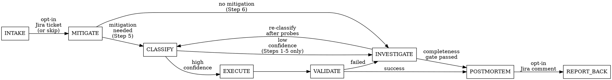

# Incident Analysis

Tiered GCP log investigation with playbook-driven mitigation and structured validation. Stages: (opt-in) INTAKE → MITIGATE → CLASSIFY → INVESTIGATE → EXECUTE → VALIDATE → POSTMORTEM → (opt-in) REPORT-BACK. Detects available tools at runtime and uses the best tier. Playbook YAML files define mitigation commands, safety invariants, and validation criteria.

## Stage Flow



Key re-entry paths:
- **CLASSIFY < 60 → INVESTIGATE:** Only Steps 1–5 run. Steps 6–9 skipped. Findings feed back to CLASSIFY.
- **VALIDATE failed → INVESTIGATE:** Full Stage 2. The mitigation didn't work.

## Quick Reference — Symptom to Playbook

| Symptom | Likely Playbook | Category |
|---------|----------------|----------|
| Error spike after deploy | bad-release-rollback | bad-release |
| CrashLoopBackOff / pod restarts | workload-restart | workload-failure |
| Multi-pod probe timeout on one node | node-resource-exhaustion | infra-failure |
| Node NotReady / kubelet down | infra-failure | infra-failure |
| CPU/memory saturation + traffic spike | traffic-scale-out | resource-overload |
| Config change correlated with errors | config-regression | bad-config |
| Upstream dependency errors | dependency-failure | dependency-failure |

**When NOT to use this skill:**
- Capacity planning or resource right-sizing without an active incident — use proactive monitoring tools instead
- Alert tuning or alert hygiene — use the `alert-hygiene` skill
- Non-production debugging (local dev, CI failures) — use `systematic-debugging`
- Performance optimization without user-facing symptoms — not an incident

## Behavioral Constraints (Always Active)

### 1. HITL Gate — No Autonomous Mutations

If a mutating action is identified (restart service, rollback deployment, scale pods, modify config), you MUST present the exact command you intend to run and HALT completely. Wait for explicit user confirmation before executing. Prefix any such command with a `RISK:` label (`references/command-risk.md`); read-only queries are never labeled.

### 2. Scope Restriction — No Global Searches During Incidents

During active investigation, all application-level file reads, log queries, and code searches MUST be constrained to the specific service or trace ID identified in Stage 1 (MITIGATE). Global codebase searches (unbounded grep, recursive find) are forbidden. This prevents context window exhaustion and irrelevant noise during time-sensitive debugging.

**Bounded exceptions:** (a) Infrastructure escalation — when Step 3 identifies multi-pod failures indicating a node-level root cause, scope expands to the affected node(s) and their infrastructure signals. The completeness gate (Step 8, Q6) may require checking peer nodes. (b) Shared resource — when Step 2 identifies Tier 1 errors in adjacent services, or Step 3 identifies a shared resource under pressure, scope expands to the shared resource's known consumer set. Both escalations are bounded to specific implicated targets, not the entire cluster or organization.

### 3. Temp-File Execution Pattern (Tier 2 Only)

For any LQL query longer than 5 words or containing quotes/regex, write the query to a session-scoped temp file via `mktemp` and execute via file read. This avoids escaping failures and concurrent-session race conditions:

```bash
LQL_FILE=$(mktemp /tmp/agent-lql-XXXXXX.txt)
cat > "$LQL_FILE" << 'QUERY'
resource.type="cloud_run_revision"
AND resource.labels.service_name="checkout-service"
AND severity>=ERROR
AND timestamp>="2026-03-19T10:00:00Z"
QUERY

gcloud logging read "$(cat "$LQL_FILE")" \
  --project=my-project --format=json --limit=50 ; rm -f "$LQL_FILE"
```

The `;` operator ensures cleanup runs regardless of whether `gcloud` succeeds or fails. `mktemp` with a random suffix prevents concurrent sessions from overwriting each other's queries.

### 4. Context Discipline on Stage Transitions

Claude cannot literally clear its context window mid-session. This constraint is enforced **behaviorally** through prompt instructions:

When transitioning from INVESTIGATE to POSTMORTEM:
1. Write a synthesized summary of the timeline and root cause as an explicit output block
2. From that point forward, you are **strictly forbidden from referencing the raw JSON log outputs** from earlier in the conversation
3. Draft the postmortem **ONLY from the synthesized summary**
4. No further log queries or source code reads are permitted during POSTMORTEM

### 5. Evidence Freshness Gate

If the user has not approved a mitigation proposal within the playbook's `freshness_window_seconds` of evidence collection, the proposal is retracted. Return to CLASSIFY with fresh queries. Stale evidence cannot be acted upon.

### 6. Evidence Ledger — Reuse Within Freshness Window

Maintain a mental ledger of evidence collected during the investigation, keyed by query fingerprint. The key must include enough dimensions to prevent collapsing different namespaces, trace-scoped vs service-scoped reads, or caller-vs-affected-service queries. The fingerprint varies by query type to prevent false collisions:

| Query type | Fingerprint key |
|-----------|----------------|
| Log queries (LQL) | `(service, environment, severity, LQL_filter_hash, time_window)` |
| Metric queries | `(service, environment, metric_type, aggregation, time_window)` |
| kubectl queries | `(resource_kind, name, namespace, context, output_format)` — e.g. `get deployment/X -o json` vs `rollout history` vs `jsonpath={.status.readyReplicas}` are distinct entries |
| Trace queries | `(trace_id, project_id)` |
| Source analysis | `(repo, commit_ref, file_path)` |

Before issuing a query matching a prior entry: reuse if within `freshness_window_seconds` (default 300s), labeling output as `reused (collected at <UTC>)`. If stale, re-query and update.

**Mandatory re-query exceptions:** EXECUTE fingerprint recheck, VALIDATE sampling, and user-requested fresh data — always re-query live state.

### 7. Evidence-Only Attribution — No Speculative Causal Claims

Every causal claim in synthesis, YAML, and postmortem must reference a specific query result. Words like "likely", "probably", "possibly" are prohibited in final attribution — replace with evidence-backed language (`"caused by X (evidence: [result])"`) or move to `open_questions`. Speculative language IS permitted in intermediate notes where it drives the next query.

**Self-check:** Before emitting the Step 7 synthesis, scan for "likely", "probably", "possibly", "presumably", "may have", "might be" in causal sentences. Replace each with evidence-backed language or move to `open_questions`.

### 8. MCP Result Processing — Never Re-Parse Cached Files

MCP tool results (especially `list_log_entries` and `list_time_series`) can exceed Claude Code's result caching limit (~100K characters). The `tool-results/` file on disk will contain truncated JSON — reading it via `cat ... | jq`, `python3 json.loads(open(...))`, or similar will fail with a parse error.

Note: This constraint applies to on-disk `tool-results/` files written by the Claude Code harness, not to the Evidence Ledger (Constraint 6). Reusing results held in-context is still governed by Constraint 6's freshness rules.

**Rules:**

1. **Extract needed fields in the same turn the MCP tool returns.** Summarize timestamps, severity, error messages, trace IDs, and resource labels directly from the tool response. Do not defer processing to a later Bash command that reads the cached file.

2. **Never read `tool-results/` files.** If you find yourself writing `cat tool-results/...`, `json.load(open('tool-results/...'))`, or piping a cached MCP result through jq — STOP. Re-invoke the MCP tool with a smaller `page_size` instead.

3. **If a single MCP response is too large to process inline**, re-query with `page_size` halved (50 → 25 → 10) requesting only needed fields. At `page_size=10`, fall back to Tier 2 using Constraint 3's temp-file pattern.

4. **For multi-step processing of the same result set** (e.g., fingerprint then exemplar extraction), summarize the result into a compact intermediate form (list of `{timestamp, severity, message_prefix, trace_id}` objects) in the same turn the MCP tool returns. Reference the summary in subsequent steps — not the raw result and not a cached file.

**Self-check:** Before issuing any Bash command, check whether the command path contains `tool-results/`. If it does, stop and re-invoke the MCP tool with a smaller `page_size` instead.

### 9. Intermediary-Layer Investigation Discipline

When the symptomatic entry point is an intermediary — reverse proxy, API gateway, service mesh sidecar, message broker, or load balancer — errors observed at that layer describe **where** the system broke but not **why**. Before forming a root cause hypothesis (Step 5), identify and query every distinct downstream service that appears in the intermediary's error logs.

**Scope boundary:** This sweep is bounded to services explicitly named in the intermediary's error output. It does not authorize cluster-wide searches.

Step 3c codifies this sweep as a structured procedure with inventory output.

### 10. Dual-Layer Investigation

For every service in the error chain, the investigation must assess both the infrastructure layer (deployment history, pod state, resource pressure) and the application layer (exception class, error mechanism). Neither layer alone is sufficient to close an investigation.

**Minimum per-service evidence (enforced via Step 3c):**
- **Infrastructure:** 72-hour deployment history + at least one runtime signal (pod state/events, resource metrics, or error rate trend)
- **Application:** the service's own ERROR logs queried, dominant exception/error class identified, mechanism status recorded as `known` (traced to code path, cache state, or consumer behavior) or `not_yet_traced` (error class known, mechanism not investigated)

**Full mechanism-level depth** is mandatory for:
- The chosen root-cause service (must trace to specific code path, cache/config state, retry/amplification behavior, or consumer mechanism)
- Any service that triggers Step 3c → Step 3 re-entry (see Step 3c escalation rule)

For all other services, mechanism status `not_yet_traced` is acceptable — it records that the error class is known but the application-layer mechanism was not deeply investigated. This prevents over-investigation of obvious victims while ensuring the root-cause service is traced to mechanism.

**Anti-pattern this prevents:** Building a complete, internally-consistent infrastructure narrative (timeouts, resource pressure, GC pauses) while the actual root cause is an application-layer bug (stale cache, template error, retry storm) in a service whose ERROR logs were never queried.

### 11. Intermediate Conclusion Verification

Any intermediate conclusion that will be used in the causal narrative must be explicitly stated and tested with at least one disconfirming query before building on it. This applies to conclusions formed during any investigation step, not just the final hypothesis.

**Common intermediate conclusions that require verification:**
- "This error is baseline noise" → query the baseline rate and compare numerically (see Tier 3 verification rule)
- "This service is healthy / not involved" → query its own ERROR logs in the incident window
- "This failure is dependent on the primary root cause" → verify the service's error class matches the hypothesized mechanism
- "This workload is the trigger" → check whether it ran without incident on the previous cycle (see recurring-workload trap)
- "This service's 403/500 responses are expected" → verify the response rate against a non-incident baseline

**Self-check:** Do not build the next investigation step on a conclusion that was inferred but not queried. If you catch yourself thinking "this is probably X" without having queried for confirmation, stop and query.

### 12. Evidence Links

For each claim surface in the Step 7 synthesis — chosen root-cause statement, each ruled-out hypothesis, and each `service_error_inventory` entry — include clickable verification links when URL parameters were captured at query time. This constraint is active across Steps 2-7.

**Caps:** max 3 links per root cause, max 2 per ruled-out, max 3 per inventory entry. Omit when URL parameters are unrecoverable. Never emit placeholder, reconstructed, or guessed URLs.

**Capture rule:** Record link inputs (project_id, LQL filter, time window, trace_id, commit SHA, metric_type) at query time. Retroactive construction is permitted only when exact original query parameters are visible verbatim in the conversation — never from prose summaries or inferred values.

Full specification — link types, YAML shape, priority rule, omission rules, label normalization, URL templates: `references/evidence-links.md`.

### 13. Parallel Execution Strategy — Batch Independent Queries

Full detail: see `references/parallel-execution.md`.

## Investigation Modes

### Default: Full Investigation

The complete 6-stage pipeline with all steps executed in order: access gate, full inventory, impact quantification, aggregate fingerprint, investigation, classification, and postmortem. This is the default for `/investigate` and all incident-analysis activations.

### Opt-In: Live Triage

An explicit fast path that prioritizes time-to-first-hypothesis for active, ongoing incidents. Activated only when the user explicitly requests it (e.g., "quick triage", "what's happening right now", "live triage"). The skill may suggest this mode when the prompt describes an active incident, but must not silently switch into it.

**Live-triage behavior — what changes:**

| Step | Full Investigation | Live Triage |
|------|-------------------|-------------|
| Step 1b (Access Gate) | Blocking — wait for fix or explicit proceed | Non-blocking — snapshot access state, proceed immediately, note gaps |
| Step 2b (Inventory) | Full — replicas, distribution, resources, probes, scheduling | Light inventory only — replica count and current status (one query). Deep inventory deferred until after first hypothesis or when symptoms indicate node/distribution dependence |
| Step 2c (Impact) | Before first log query | Deferred until after first hypothesis |
| Steps 3-4 | Unchanged | Unchanged |
| Steps 5-9 | Unchanged | Unchanged |
| CLASSIFY/EXECUTE/VALIDATE | Unchanged | Unchanged — fingerprint recheck, completeness gate, and all safety rules apply |
| POSTMORTEM | Unchanged | Unchanged |

**What does NOT change in live-triage:**
- Access state is still recorded for evidence_coverage
- Light inventory still captures replica count (prevents gross mis-scoping)
- The completeness gate still runs — deferred steps are flagged as gaps if never backfilled
- EXECUTE fingerprint recheck is never skipped
- HITL gate for mutations is never skipped

**Mode recorded in synthesis:** The `investigation_summary.scope.mode` field captures which mode was used, so the postmortem and completeness gate know whether deferred steps were intentional.

## INTAKE (opt-in Jira ticket)

Create or adopt a Jira ticket before investigation begins. This stage is opt-in: it activates only when the user explicitly requests a ticket (e.g. "file a Jira ticket") or supplies a ticket key (e.g. "investigate NC-1234"). When neither signal is present, skip INTAKE and begin at Stage 1. On creation, present the exact ticket payload and HALT for approval before calling `createJiraIssue`. Full procedure: `references/jira-intake.md`.

## Stage 1 — MITIGATE

### Step 1: Detect Available Tools

Run the shared observability preflight to check environment readiness:

```bash
bash "${CLAUDE_PLUGIN_ROOT}/scripts/obs-preflight.sh"
```

Parse the JSON output to select the execution tier:

**Tier 1 — MCP (`@google-cloud/observability-mcp`):**
If you have access to `list_log_entries`, `search_traces`, `get_trace`, `list_time_series`, or `list_alert_policies` as MCP tools in this session, **verify auth before classifying as Tier 1**. Make a lightweight probe call (e.g., `list_log_entries` with `pageSize=1` and a narrow 1-minute window) to confirm the tools return data rather than auth errors.

**If the probe fails with an auth error** (`invalid_grant`, `invalid_rapt`, `UNAUTHENTICATED`, `token expired`):
1. Report the specific error to the user
2. **Immediately offer the fix** — do NOT silently fall back to Tier 2:

   > "MCP Observability auth expired (`<error>`). Tier 1 provides metrics, traces, and error reporting that gcloud CLI cannot. Fix now with:
   > ```
   > ! gcloud auth application-default login
   > ```
   > This opens a browser for re-authentication. Proceed?"

3. If the user re-authenticates, re-probe to confirm, then classify as Tier 1
4. **Only fall back to Tier 2 if the user explicitly declines** (e.g., "skip it", "proceed without", "no time"). Record the declined fix in the access gate for `evidence_coverage`.

**Why this matters:** Tier 2 (gcloud CLI) cannot do `list_time_series` (metrics), `get_trace` (trace correlation), or `list_group_stats` (error reporting). Silently falling back to Tier 2 creates investigation gaps that are expensive to discover later — especially for database metrics, which are often the missing piece in shared-resource incidents. The few seconds to re-authenticate are far cheaper than the gaps.

**Tier 2 — gcloud CLI via Bash:**
```bash
command -v gcloud && gcloud logging read --help >/dev/null 2>&1 && echo "gcloud: available" || echo "gcloud: not available"
```
If gcloud is available but not authenticated, guide through `gcloud auth login` and `gcloud auth application-default login`.

**Tier 3 — Guidance-only:**
If neither MCP tools nor gcloud are available, provide manual Cloud Console instructions (Logs Explorer URL patterns, filter syntax).

**Tier upgrade nudge:** If using Tier 2 (gcloud CLI) and Tier 1 MCP tools are not available, include a one-line note after reporting the tier:

> "Using gcloud CLI (Tier 2). For faster queries with autonomous trace correlation, run `/setup` to configure GCP Observability MCP (Tier 1)."

Do not repeat this nudge after the first mention.

### Step 1b: Access Gate — Fix Before Proceeding

After detecting the execution tier, present a tool access summary and prompt the user to fix **fixable** gaps (expired auth, wrong context) before continuing. Do not block on unfixable gaps (tool not installed) during an active incident.

```
Tool access:
  MCP observability: available | auth expired (fixable) | unavailable
  gcloud auth:       active (project X) | expired | not configured
  kubectl context:   available (context Y) | unavailable
  GitHub CLI (gh):   authenticated | not authenticated | not installed

Investigation domains:
  Logs:              ✓ complete (Tier N) | ⚠ partial | ✗ unavailable
  Metrics:           ✓ complete (Tier N) | ⚠ partial (Tier 2 — no list_time_series) | ✗ unavailable
  K8s state:         ✓ complete | ✗ unavailable
  Source analysis:    ✓ complete | skipped | ✗ unavailable
  Trace correlation: ✓ complete (Tier 1 only) | skipped | ✗ unavailable
```

**MCP auth expired is always a fixable gap.** When the access gate shows `auth expired (fixable)`, the Metrics and Trace correlation domains will show degraded or unavailable. Present this prominently:

> "⚠ MCP auth expired — Metrics (`list_time_series`), Traces (`get_trace`), and Error Reporting (`list_group_stats`) will be unavailable. Fix with `! gcloud auth application-default login`?"

**If any other fixable gap is detected**, present the fix command and ask:

> "⚠ [Domain] will be unavailable without [tool/auth]. Fix now, or proceed with degraded access?"

Wait for the user to fix or explicitly proceed. Record the access state — including whether a fix was offered and declined — for the `evidence_coverage` block in Step 7.

### Step 2: Establish Scope

Identify:
- Which service?
- Which environment (production, staging)?
- What time window? (default: last 30-60 minutes). If the user provides a local time (e.g., "it broke at 2pm"), convert to UTC using the session's timezone (`date +%z`) before querying. If the session timezone cannot be determined, ask the user. All subsequent timestamps in the investigation and postmortem MUST be in UTC.

### Step 2b: Establish Inventory

Before querying logs, determine what you are investigating:
- How many replicas/instances exist? (query metrics or deployment spec — do not infer from logs)
- Where are they distributed? (nodes, zones, regions)
- What are the resource requests, limits, and probe configurations?
- For k8s workloads: scheduling constraints — pod affinity/anti-affinity rules, topologySpreadConstraints, node affinity, taints and tolerations. Query from the same deployment spec used for resource requests. If kubectl is unavailable, check GitOps manifests via `gh api` or `git show` as fallback.

This prevents scoping errors (investigating 4 pods when 7 exist) and reveals distribution risks (3 of 7 pods on one node) before they become surprises in the postmortem. For k8s, use `container/memory/request_bytes` grouped by pod name. For other platforms, use the equivalent inventory query.

Note: topologySpreadConstraints and podAntiAffinity both control pod distribution — if either is present, the workload has scheduling constraints. Distinguish enforcement level: soft (ScheduleAnyway, preferredDuringScheduling) vs hard (DoNotSchedule, requiredDuringScheduling).

When live cluster access is unavailable for inventory or action item verification, fall back to GitOps manifests (`gh api repos/ORG/REPO/contents/PATH` or `git show`) to check deployment configuration. If neither is available, flag affected inventory fields and action items as unverified.

### Step 2c: Quantify User-Facing Impact

Before diving into root cause, establish the impact magnitude from available sources:
- **From metrics (query):** HTTP 5xx **and 4xx** error count/rate at the load balancer or ingress (a persistent per-user failure is often a **404 for a not-yet-provisioned resource**, not a 5xx), SLI degradation (latency, availability), affected endpoint paths.
- **From alerts (check):** If an SLO burn rate alert fired for this service in the time
  window, note the alert name, burn rate value, and error budget remaining. This provides
  severity context before the deep dive. Check via `list_alert_policies` (Tier 1) or
  `gcloud alpha monitoring policies list` (Tier 2).
- **From user-provided context (do not query):** support tickets, user reports, business impact descriptions. Incorporate if provided but do not attempt to query external support/ticket systems.
- **If neither is available:** state "user-facing impact not quantified" and proceed. Do not estimate.

This frames severity before the deep dive — a 1,100-error incident gets different treatment than a 5-error incident.

**Clean 5xx/ERROR sweep ≠ backend healthy.** `severity>=ERROR`/`status>=500` both exclude **4xx**; a persistent per-user failure with a clean 5xx sweep is often a **404 for a not-yet-provisioned resource**, visible only at the gateway/access-log layer or an app-level status field. See `references/4xx-sweep-blind-spot.md`.

### Step 2d: Baseline-First Gate — Skip Baseline Signals Early

Before deep-diving into any error signal, compare its count against a baseline from a non-incident period (same service, same error class, same time-of-day window on a prior day — preferably the same weekday).

**Decision rule:**
- **count_incident < 1.5 × count_baseline** → **baseline** — skip. Do NOT deep-dive. Record in the synthesis as `"baseline — skipped (N incident vs M baseline)"` and move on.
- **1.5× ≤ count_incident < 10× count_baseline** → **elevated** — proceed with investigation but note the baseline for context.
- **count_incident ≥ 10× count_baseline** → **anomalous** — prioritize for immediate deep-dive.
- **count_baseline = 0 and count_incident > 0** → **new** — always investigate.

These are rate-based classifications independent of the Step 2 error taxonomy. A Tier 2 infrastructure error at baseline rate is still classified as **baseline** and skipped.

**When to apply:** This gate applies at two points:
1. **Step 3 (initial error query)** — before selecting which error signals to pursue in Steps 3b/4
2. **Step 3c (multi-service sweep)** — before deep-diving into any service's errors (item 2 in the procedure)

**Why this matters:** Without this gate, the investigation will deep-dive into every error signal regardless of whether it's normal. In one investigation, ~4 query round-trips were spent investigating 403 errors that turned out to be at baseline rate (4,948 vs 5,000) — time wasted that could have been spent on the actual anomaly (JDBC errors: 500 vs 0 baseline).

**Implementation:** Query the incident count and baseline count **in parallel** (two queries in the same batch). Compute the ratio before proceeding. This adds one query round-trip but saves many by eliminating baseline signals early.

### Step 3: Query Error Rate / Recent Errors

Scoped to the identified service + narrow time window.

**Tier 1:** Use `list_log_entries` with LQL filter scoped to service + severity + time window, `page_size` <= 50.

**Tier 2:** Use the temp-file execution pattern (see Constraint 3) with `gcloud logging read` and `--limit=50`.

### Step 3b: Aggregate Error Fingerprint

Before reading raw log entries for pattern extraction, query the error distribution to identify the dominant error class. This prevents sample bias — 50 recent entries can overrepresent the latest error class instead of the most frequent one.

**Preferred path — Error Reporting API (identifies error signatures):**

**Tier 1:** If `list_group_stats` is available as an MCP tool, use it with the service's project_id and the investigation time range. This provides server-side grouping by recurring error signature with counts.

**Tier 2:** If gcloud is available, try `gcloud beta error-reporting events list --service=<service> --format=json --limit=20`. Same backend, same output.

**If Error Reporting is unavailable** (API not enabled, tool not present, or service doesn't emit structured errors):

**Tier 1/2 fallback — severity counts:** Query `list_time_series` with `logging.googleapis.com/log_entry_count` to get error volume by severity and container. This answers "how many errors?" but not "which error classes?" — use it for magnitude only.

**Tier 2 fallback — client-side bucketing:** Fetch up to 100 log entries (2× the normal Step 3 sample) and group by error message prefix (first 80 chars of `jsonPayload.message` or `textPayload`). **⚠ This is sample-biased** — label results as `aggregation_source: sample` in the synthesis.

**If no aggregate source is available at all:** Proceed with Step 3's existing 50-entry sample. Note `aggregation_source: unavailable` in the synthesis and record as a gap.

**Output:** Identify the top 3-5 error buckets by frequency. Record:
- `aggregation_source`: `error_reporting` (signature-grouped), `metric` (severity counts only), `sample` (client-side bucketing), or `unavailable`
- Dominant bucket with count/percentage
- Whether dominance is clear (>50% of errors) or ambiguous (no bucket >30%)

**Step 4 then becomes exemplar-driven:** Fetch 3-5 raw log entries per dominant bucket for detailed analysis (stack traces, request IDs, trace IDs). Raw logs are exemplars for known buckets, not the discovery mechanism.

### Step 4: Identify Failing Request Pattern (Exemplar-Driven)

Using the dominant error buckets from Step 3b, fetch 3-5 raw log entries per top bucket as exemplars. Extract: endpoint, error code, stack traces, request/trace IDs. If Step 3b was skipped (aggregate tools unavailable), fall back to the current behavior: extract patterns from the Step 3 sample, but note `aggregation_source: unavailable` in the synthesis.

### Step 5: Mitigation Routing

If mitigation is needed, transition to CLASSIFY for structured playbook selection. All mutating actions must go through the playbook framework — the agent cannot propose bare commands outside the safety contract. If no playbook matches, transition to INVESTIGATE or provide manual guidance.

### Step 6: Transition

If a code fix is needed (no mitigation required), transition to INVESTIGATE.

## CLASSIFY

Structured playbook selection. Entered from MITIGATE Step 5 when mitigation is needed. Evaluates signals against candidate playbooks, scores them, and routes to the appropriate confidence tier.

### Playbook Discovery

Load candidate playbooks from two sources:

1. **Bundled playbooks:** `skills/incident-analysis/playbooks/*.yaml` (shipped with the plugin)
2. **Repo-local overrides:** `playbooks/incident-analysis/*.yaml` (project-specific)

Resolution is by `id` — a repo-local playbook with the same `id` as a bundled playbook replaces the bundled version entirely. Repo-local playbooks with unique IDs are added to the candidate set.

### Signal Evaluation

For each signal referenced by candidate playbooks, evaluate against current evidence to produce a tri-state result:

| State | Meaning |
|-------|---------|
| `detected` | Signal is present in the collected evidence |
| `not_detected` | Signal was explicitly looked for and is absent |
| `unknown_unavailable` | Cannot evaluate (tool unavailable, data not collected, ambiguous) |

**Compound signal propagation:**
- `any_of`: detected if ANY child is detected; not_detected if ALL children are not_detected; unknown_unavailable otherwise
- `all_of`: detected if ALL children are detected; not_detected if ANY child is not_detected; unknown_unavailable otherwise

Signal definitions are loaded from `skills/incident-analysis/signals.yaml`.

### Scoring, Routing, and Decision Records

Scoring formula, confidence-gated routing (high/medium/low), loop termination, disambiguation anti-looping, and decision record templates are in `references/classify-scoring.md`.

**Quick summary:** Each playbook scores `confidence = clamp(0,100, round(base_score - contradiction_score) / evaluable_weight × 100)`. Veto signals disqualify immediately. Coverage gate requires evaluable_weight/max_possible ≥ 0.70. High confidence (≥85 with ≥15pt margin) → HITL gate. Medium (60-84) → disambiguation probes then re-rank. Low (<60) → INVESTIGATE Steps 1-5 then re-classify.

## Stage 2 — INVESTIGATE

**Re-entry from CLASSIFY (< 60 path):** When entered from the CLASSIFY low-confidence path, only Steps 1-5 run. Steps 6-9 (Flight Plan, Timeline Extraction, context synthesis, completeness gate, POSTMORTEM transition) are SKIPPED. Findings feed back to CLASSIFY for reclassification.

### Step 1: Query Logs with Narrowed Filter

Use LQL scoped to service + severity + time window identified in Stage 1.

### Step 2: Extract Key Signals

Stack traces, error messages, request IDs, trace IDs.

**Error taxonomy — prioritize by diagnostic value:** Classify signals into Tier 1 (anomalous — trigger indicators), Tier 2 (infrastructure — where it's breaking), Tier 3 (expected — at verified baseline rates). Investigate Tier 1 first. Message broker signals are always Tier 1 — trace to consumer's exception before investigating downstream infrastructure symptoms. Tier 3 requires a verified baseline rate comparison; "this looks like it always happens" is not evidence — query the baseline rate. Container exit codes (0, 1, 137/OOMKilled, 139/SIGSEGV, 143/SIGTERM) guide investigation routing. Full taxonomy, exit code guide, and routing rules: `references/error-taxonomy.md`.

### Targeted Disambiguation Probes (Conditional — CLASSIFY Handoff)

When entered from the CLASSIFY low-confidence path with a SHORTLIST handoff artifact,
execute the disambiguation probes listed for each runner-up. Probes are read-only,
aggregate-first queries (max_results <= 10) that target signals specific to the runner-up
playbook. Each probe runs once per classification fingerprint.

**Scope exception:** Disambiguation probes may query declared/known dependencies of the
affected service, within the same time window as the primary investigation
(e.g., upstream APIs, backing datastores) even though those are technically
outside the single-service scope restriction. This is permitted because playbook
`disambiguation_probe` definitions are pre-authored and bounded — they cannot expand into
unbounded global searches.

After all probes complete, feed results back to CLASSIFY for reclassification.

### Step 3: Single-Service Deep Dive

- Error grouping (frequency, first/last occurrence)
- Recent deployment correlation (deploy timestamp vs. error spike?)
- Resource metrics (CPU, memory, latency) if available
- **Database/connection-pool metrics (conditional — when JDBC or connection errors are present):**

  When the service shows `JDBCConnectionException`, `acquisition timeout`, `pool exhausted`, `ConnectionRefused` to a database, or Cloud SQL proxy errors, **query the database's own metrics before attributing the issue to database capacity**. This is mandatory — do not conclude "database under pressure" or "connection starvation" from application-side errors alone.

  **Required queries (incident window + baseline, in parallel per Constraint 13):**

  | Metric | Tier 1 (`list_time_series`) | Tier 2 (REST API via `curl` + `gcloud auth print-access-token`) |
  |--------|----------------------------|----------------------------------------------------------------|
  | Connection count | `cloudsql.googleapis.com/database/network/connections` | Same metric via Monitoring REST API |
  | CPU utilization | `cloudsql.googleapis.com/database/cpu/utilization` | Same metric via Monitoring REST API |
  | Query rate | `cloudsql.googleapis.com/database/mysql/questions` (MySQL) or `cloudsql.googleapis.com/database/postgresql/transaction_count` (PostgreSQL) | Same metric via Monitoring REST API |

  **Decision branch:**

  | DB metrics vs baseline | Diagnosis | Investigation route |
  |------------------------|-----------|-------------------|
  | Connections, CPU, query rate all **normal** (within 1.5x baseline) | **App-side pool exhaustion** — connections held too long, not too many | Investigate application: slow queries holding connections, transaction scope changes, connection leak, pool sizing (max size, timeout, leak detection). Check deployment history for code changes affecting connection lifecycle. |
  | Connections **elevated** (approaching or at `max_connections`) | **Database-level exhaustion** — too many consumers | Investigate database: `max_connections` setting, per-service pool sizing, total connection demand across all consumers. Consider connection isolation (dedicated instances for critical services like auth). |
  | CPU **elevated** (>80%) or query rate **spiked** | **Database under load** — slow queries or query volume | Investigate database: slow query log, query plan regressions, lock contention. Check for new query patterns from recent deployments. |

  Rows are not mutually exclusive. When multiple conditions are present (e.g., connections elevated AND CPU spiked), combine diagnoses: the database is both oversubscribed and overloaded.

  **Anti-pattern this prevents:** Concluding "shared database starvation" from application-side JDBC errors when the database itself is healthy. In one investigation, this led to incorrect action items ("isolate auth service DB") that were revised after database metrics showed normal connection count, CPU, and query rate — the issue was app-side pool exhaustion (connections held too long under normal DB load).

- **Application-logic analysis (for the dominant error path):**
  - **Call pattern detection:** From stack traces in Step 2 exemplars, determine whether the failing code path makes sequential (N+1) calls to the degraded dependency. A loop calling `checkPermission()` per item is N+1; a single `batchCheck()` call is not. If N+1 is detected, note the amplification factor (items per request x latency per call = total request latency).
  - **Retry/amplification analysis:** Check whether the calling code retries failed requests. If a 3-second timeout triggers a retry, each retry adds 3 more seconds of dependency pressure. Look for retry configuration in the stack trace's framework (e.g., Camel redelivery, Spring Retry, gRPC retry policy).
  - **gRPC connection distribution (conditional — when dependency uses gRPC):** If server-side logs include `peer.address`, sample 1 minute of calls and group by caller IP. Compare the distribution against the expected even split (1/N where N = number of client pods). If one caller's share is disproportionately high relative to the expected baseline, flag as potential connection pinning (HTTP/2 over K8s Service ClusterIP load-balances at connection level, not request level). Note: there is no universal threshold — what matters is whether the skew is large enough to explain the observed latency. Report the actual distribution and let the investigator judge.

**CrashLoopBackOff triage (conditional — when `crash_loop_detected` signal is present):** Complete the diagnostic sequence in `workload-restart` playbook's `investigation_steps` before proposing restart: pod describe → events → termination reason and exit code → previous container logs → deployment/probe config → rollout history correlation. Redirect to other playbooks when evidence warrants (OOMKilled → resource, stack trace after deploy → bad-release, ImagePullBackOff/CreateContainerConfigError → pod-start failure). Full CrashLoopBackOff triage, probe/startup-envelope checks, and Pod-start failure branch: `references/deep-dive-branches.md`.

**Infrastructure escalation (conditional):** If Step 3 reveals that multiple pods or services are failing simultaneously — especially with `context deadline exceeded`, widespread probe timeouts, or errors localized to a single node — verify whether the root cause is at the node or infrastructure level by checking:
- Node resource metrics (memory/CPU allocatable utilization)
- kubelet logs (housekeeping delays, probe failures, eviction events)
- GCE serial console (kernel OOM, balloon driver, memory pressure)
- Audit logs (maintenance-controller, drain events)

If a `node-resource-exhaustion` playbook is available, transition to CLASSIFY for structured scoring.

**Shared resource escalation (mandatory when detected):** If the degraded service is used by multiple consumers (authorization service, database, message broker, cache cluster, shared API gateway), follow the caller investigation procedure in `references/caller-investigation.md`. This is mandatory, not optional. The procedure identifies dominant callers, checks their ERROR logs and deployment history, compares distribution to baseline, and checks for amplification loops. Bounded to the shared resource's known consumer set — no unbounded global searches.

### Step 3c: Multi-Service Error Sweep

**Gate:** This step is mandatory when the error chain involves 2 or more services — whether discovered through an intermediary layer (Constraint 9), trace correlation (Step 4), shared-resource escalation (Step 3), or proxy error logs. Skip only for confirmed single-service incidents with no cross-service error signals.

**Parallel sweep pattern (Constraint 13):** When the error chain involves 3+ services (typically discovered through an intermediary layer), dispatch the per-service queries in parallel rather than sequentially (for 2 services, sequential execution is acceptable). Specifically:

1. **Architecture discovery batch (one parallel round):** Query all containers in the namespace with ERROR logs grouped by container name + deployment history for the 72h window + auth/identity service errors. This reveals the full service landscape and recent changes in a single round-trip instead of discovering services one at a time.

2. **Per-service sweep batch (one parallel round):** For each service identified in the architecture discovery, dispatch items 1-3 of the procedure below (ERROR logs + error classification + deployment history) as parallel queries. Each query is independent — they target different services with the same query template.

3. **Baseline comparison batch (one parallel round):** For each service's error count from the sweep, query the baseline count from a prior day in parallel. Feed results into the Step 2d baseline-first gate to skip baseline signals before deep-diving.

This pattern collapses an N-service sequential sweep (N round-trips) into 3 parallel rounds regardless of N. The procedure below describes what to query per service; this pattern describes how to batch the execution.

**Procedure:** For each service in the error chain not yet deeply investigated:

1. **Query the service's own ERROR logs** in the incident time window (not the calling service's logs or the intermediary's access logs — the service's own container stderr/stdout). Use page_size <= 10 initially. If results are too large, extract error message summaries via Tier 2 gcloud (`--format="csv[no-heading](jsonPayload.message)" | sort | uniq -c | sort -rn`).

2. **Classify errors** using the Step 2 taxonomy. Prioritize:
   - **Tier 1 anomalous errors in non-obvious services** — an application-specific exception (parsing, template, schema) in a small service is more diagnostic than a generic timeout in a large one
   - **Message broker delivery failures** — trace to the consumer's own exception (see Step 2 message broker rule)
   - **Connection pool exhaustion** (`JDBCConnectionException`, `Acquisition timeout`, `pool exhausted`) — indicates this service is an epicenter, not just a victim. **When found, trigger the database metrics gate (Step 3) for this service's backing database before proceeding.** The gate determines whether the exhaustion is app-side (connections held too long — normal DB metrics) or database-level (DB at capacity — elevated DB metrics). Record `pool_exhaustion_type: "app-side" | "database-level" | "not_determined"` in the service inventory. Different types require different action items: app-side → investigate application connection lifecycle; database-level → investigate DB capacity and connection isolation.

3. **Check the 72-hour deployment history** for each service. A deployment to **any** service in the error chain is a candidate trigger — not just the service initially suspected.

4. **Gather per-service runtime signal (Constraint 10):** For each service, collect at least one runtime signal beyond deployment history — pod state/events, resource metrics (CPU, memory), or error rate trend. This satisfies the infrastructure layer minimum. Record `infra_status` as `assessed` when deployment history + runtime signal are both collected, or `unavailable`/`not_captured` with reason if not. Record `app_status` as `assessed` when ERROR logs were queried and dominant exception class identified (items 1-2 above), or the appropriate status with reason. Record `mechanism_status` as `not_yet_traced` (default for non-root-cause services) or `known` if the error mechanism was traced during this sweep.

5. **Rank services by diagnostic value:** The service with the highest-tier errors and the most anomalous rate change from baseline is the primary investigation target for Step 5. **If this differs from the service investigated in Step 3, revise your focus.** Do not anchor on the first service investigated simply because more evidence has been collected for it.

**Output:** A `service_error_inventory` table in the Step 7 synthesis:

```yaml
service_error_inventory:
  - service: "<name>"
    error_class: "<dominant error>"
    tier: 1|2|3
    count_incident: <N>
    count_baseline: <N>
    deployment_in_72h: true|false
    deployment_timestamp: "<UTC or null>"
    investigated: true|false
    infra_status: "assessed" | "not_applicable" | "unavailable" | "not_captured"
    infra_evidence: "<what was checked>"
    infra_reason: "<why not assessed, if status != assessed>"
    app_status: "assessed" | "not_applicable" | "unavailable" | "not_captured"
    app_evidence: "<what was checked>"
    app_reason: "<why not assessed, if status != assessed>"
    mechanism_status: "known" | "not_yet_traced" | "not_applicable"
```

**Layer status semantics:** `assessed` = Minimum required evidence for that layer is complete (infrastructure: deployment history + runtime signal; application: ERROR logs queried + dominant exception class identified). Other statuses: `not_applicable`, `unavailable` (reason required), `not_captured` (reason required). Full definitions in `references/investigation-schema.md`. Services with `investigated: false` must be flagged as gaps in `evidence_coverage`.

**Re-entry from Step 4:** If trace correlation (Step 4) discovers additional services not covered in the initial sweep, return to Step 3c and execute the procedure for the newly discovered services before proceeding to Step 5.

**Tier 1 escalation to full Step 3:** When a service meets either condition below, execute a full Step 3 deep dive for that service before proceeding to Step 5:
- The service ranks highest in diagnostic value (highest tier + most anomalous baseline change) but was not the original Step 3 target
- The service has errors of a different class than the hypothesized mechanism (suggesting independent failure, not dependent)

The full Step 3 dive includes: error grouping, deployment correlation, resource metrics, and application-logic analysis (call patterns, retry/amplification behavior, cache/config/template state). This is the same depth applied to the primary service — not the Step 3c surface sweep.

**Step 4b applicability:** Step 4b's existing gate conditions apply to re-entered services: source analysis runs when the re-entered service has (1) actionable stack frames, (2) a resolvable deployed ref, AND (3) one of the existing category gates is met (bad-release: deploy within incident window or 4h before; config-change: `config_change_correlated_with_errors` detected with git ref). The re-entry does not broaden Step 4b's gate — it extends Step 4b's applicability to additional services that meet the same criteria.

**Scope:** This re-entry is bounded to the specific service(s) meeting the trigger conditions. It does not cascade — re-entered services do not trigger further re-entries.

### Step 4: Autonomous Trace Correlation (Tier 1 Only)

If Tier 1 MCP tools are NOT available, skip this step entirely. Proceed to Step 5.

**Prerequisite — exemplar trace selection:** If Stage 2 logs contain multiple failing requests (>1), select one exemplar trace from the dominant error group (most frequent pattern) or the most recent failure with a `trace` field. Analyze only this single exemplar in Step 4.

**Extract trace_id and project_id** from the exemplar log entry's `trace` field (format: `projects/PROJECT_ID/traces/TRACE_ID`). Strip the prefix to get the raw TRACE_ID. Preserve PROJECT_ID for `get_trace`.

If no `trace` field is present in the failing log entries, skip this step entirely.

**Retrieve the trace:**
Call `get_trace(trace_id, project_id)` to retrieve the span timeline. Do NOT use `search_traces` in this step.

**Inspect spans for cross-service boundaries:**

1. **All spans within Service A only:** Skip hop. Proceed to Step 5.
2. **Exactly one other service (Service B) meets EITHER evidence path below:** Execute the hop (continue below).
3. **Multiple services meet evidence criteria, or 3+ services with any failure signals:** Present trace timeline to user. Do NOT autonomously choose. Let user specify which service.
4. **Other services appear but none meet either evidence path:** Skip hop. Note services in synthesis.

**Failure evidence (MUST be present in Service B span data — any one sufficient):**
- Span status code != OK (gRPC error)
- HTTP status >= 500 in span attributes
- Exception stack trace in span events

**Timeout cascade (ALL conditions required):**
- Service A failed with explicit timeout/deadline-exceeded error
- Service B span duration >= 80% of root span duration (computed: `(B span end - B span start) / (root span end - root span start)`)
- No other non-Service-A span >= 40% of root span duration

Latency-only spans (slow but no error/timeout) do NOT justify the hop.

If evidence is ambiguous or borderline, do NOT hop — present trace timeline and let user decide.

**Query Service B logs** using `list_log_entries`:
- **project_id:** Service B's project ID (from span resource labels). Same as Service A's if same project.
- **filter:** Scoped to `trace="projects/<Service B project>/traces/<TRACE_ID>"` AND Service B's concrete resource labels from the span data (e.g., `resource.type` plus `resource.labels.service_name` or equivalent — not all services use `service_name`; use whatever label the span provides)
- **time range:** Service B span start minus 1 minute to span end plus 1 minute
- **page_size:** <= 50 entries
- If Service B's identity (resource labels or project) is ambiguous, STOP and present trace to user.
- **STRICT CONSTRAINT:** Do not execute a second hop. Do not follow the trace into a third service.

**Synthesize the causal path only:**
- Include only spans on the causal path linking Service B's failure to Service A's error. Do not dump the full trace tree.
- Present both services' log evidence in chronological order
- If Service B logs return no useful signal, note the gap and proceed to Step 5
- Feed this synthesized causal timeline into Step 4b or Step 5

### Step 4b: Source Analysis (Conditional)

Analyzes source code at the deployed version to identify regression candidates. Full procedure in `references/source-analysis.md`.

**Gate — either path required:** (1) Actionable stack frame from Step 2, (2) Resolvable deployed ref from Step 2b, (3a) Bad-release: deploy within incident window or 4h before, OR (3b) Config-change: `config_change_correlated_with_errors` detected AND repo-backed (has git ref). User override: bypasses gate 3 but not 1-2. If no gate met: `source_analysis.status: skipped`.

**Post-hop rule:** If Step 4 shifted to Service B, resolve its workload identity from trace/log labels (not deployment name). One bounded lookup. If ambiguous, skip.

**Output:** `source_analysis.status` = `reviewed_no_regression` | `candidate_found` | `skipped` | `unavailable`. If `candidate_found`, feeds into Step 5 hypothesis. Tool tiers: GitHub API → `git show` → manual URL. Fail-open on API unavailability. Full procedure including cross-reference and bounded expansion steps in `references/source-analysis.md`.

### Step 5: Formulate Root Cause Hypothesis

State the hypothesis in one sentence. Then:

1. **Contradiction test:** Identify the strongest piece of evidence that would DISPROVE this hypothesis. Query for it. If found, revise the hypothesis before proceeding.
2. **Symptom coverage:** List every observed symptom. Mark each as "explained" or "unexplained" by the hypothesis. If any symptom is unexplained, either expand the hypothesis or note it as an open question.
3. **Per-service attribution proof (when 2+ services/components are implicated):** For every service or component named in the causal story beyond the primary, verify that its errors match the hypothesized mechanism:
   - **Query the service's own error logs** for the specific error class of the hypothesis (e.g., `DEADLINE_EXCEEDED` for a SpiceDB timeout hypothesis, `ConnectionRefused` for a database outage hypothesis).
   - **Classify attribution** as one of: `confirmed-dependent`, `independent`, `inconclusive`, or `not-investigated`:

     | Status | Criteria |
     |--------|----------|
     | `confirmed-dependent` | Service's errors match the hypothesized error class (e.g., DEADLINE_EXCEEDED found) |
     | `independent` | Service has errors but of a different class (e.g., NoResultException instead of DEADLINE_EXCEEDED). Investigate its own failure path: deployment events, application-layer bugs, config changes. |
     | `inconclusive` | Evidence queried but insufficient to determine — e.g., service has errors but error class is ambiguous, or logs are incomplete |
     | `not-investigated` | Service's own error logs were not queried. Must be recorded as a gap in `evidence_coverage`. |

   - **When `independent` is found:** The service has a separate root cause. Check deployment events (FluxCD, ArgoCD, Helm rollout events in k8s_cluster audit logs), recent config changes, and application-layer errors for that service. Record the independent root cause in the synthesis.
   - **When `inconclusive` or `not-investigated`:** Add to `open_questions` in the synthesis. Do NOT attribute the service to the shared root cause without evidence.
4. **Alternative hypotheses:** Name at least one alternative explanation. State why the primary hypothesis is preferred over it, citing specific evidence.
5. **Chronic-vs-acute test:** If the hypothesized root cause is a condition that existed before the incident (a background job, a known workload pattern, a long-standing configuration), it is a **contributing factor**, not a trigger. Ask: "This condition has existed for days/weeks — what acute change in the preceding 72 hours made it fatal *now*?" Candidates include:
   - A deployment to any service that interacts with the chronic stressor (not just the symptomatic service)
   - A traffic pattern change (weekday vs. weekend, batch job schedule, seasonal load)
   - A cache expiry, certificate rotation, or configuration reload with delayed effect
   - A concurrent failure in a different service that shares infrastructure (amplification loop — see Step 3)
   - A caller entering a failure/retry loop (check Step 3 shared resource escalation findings — if dominant callers were not yet checked, return to Step 3 and complete the caller investigation before accepting a chronic hypothesis)

   **Mandatory evidence for traffic-pattern hypotheses:** If the hypothesis attributes the trigger to a traffic pattern change (e.g., "afternoon peak traffic"), verify against a baseline from a **different day at the same time** (or the nearest comparable stable window if traffic patterns changed recently). Compare: caller distribution, call volume per caller, and method mix. If the pattern matches the baseline (same callers, same volume), the traffic hypothesis is supported. If one caller's volume is anomalously high, investigate that caller's health before accepting the hypothesis.

   **Recurring-workload correlation trap:** When a recurring workload (batch job, cron task, scheduled report, periodic cache refresh) correlates temporally with the incident, ask: **"If this workload runs every [cycle], why didn't the incident happen last [cycle]?"** Query the workload's activity on the **previous cycle** (same time yesterday for daily, same day last week for weekly). If the workload ran without incident on the previous cycle, it cannot be the sole trigger — demote it to contributing factor and search for what changed between cycles:
   - A deployment to any service the workload interacts with (check Step 3c inventory)
   - A data or configuration change that the workload now processes differently (new records, modified templates, updated schemas)
   - A cache state change from a prior failure persisting across restarts or TTL boundaries
   - An environmental change (replica count, node placement, resource limits, dependency version)

   **This is a hard gate:** A recurring workload that ran successfully on its previous cycle MUST NOT be recorded as the root cause trigger. It may be a contributing factor or amplifier but the trigger is the inter-cycle change. Exception: if no previous cycle exists (first-ever execution), this gate does not apply — the workload itself is the change.

6. **Capacity headroom check (when resource-related signals are present):** Compare current resource utilization against the nearest stable baseline (different day, same time window). Record:
   - Current vs baseline: node CPU/memory allocatable utilization, pod count, sum of resource requests
   - Headroom drift: has available capacity been shrinking over days/weeks? (query 7-day trend if metrics available)
   - HPA/quota status: is HPA at maximum replicas? Are resource quotas near limits?
   If headroom has been chronically shrinking, note as a contributing factor even if an acute trigger is identified. The acute trigger may recur at lower thresholds — the chronic drift makes the system fragile. If headroom data is unavailable, state `not_captured` with reason (e.g., "capacity metrics not available for this environment") and flag as an open question.

   If no acute change is found after active search, the hypothesis is weaker — note it as "chronic contributing factor without identified trigger" rather than confirmed root cause.

7. **Intermediate conclusion audit:** Before finalizing the hypothesis, list every intermediate conclusion in the causal chain (e.g., "Service X errors are dependent", "This error is baseline", "The batch job is the trigger"). For each, verify it was tested with a disconfirming query per Constraint 11. Any untested conclusion must either be tested now or moved to `open_questions`. Untested conclusions MUST NOT appear in the causal narrative as established facts.

8. **Anti-anchoring check (when `service_error_inventory` exists):** Compare the chosen root-cause service against the `service_error_inventory` rankings. If the chosen service is NOT the highest diagnostic-value entry, the hypothesis must include explicit evidence for why the lower-ranked service was selected instead. Valid reasons include:
   - The higher-ranked service's errors were confirmed as dependent on the chosen service (per-service attribution)
   - The higher-ranked service's errors have a known independent root cause
   - The higher-ranked service's error count is inflated by retry amplification from the actual root cause

   Without explicit justification, the gate should reject the hypothesis and redirect investigation to the highest-ranked service.

### Step 6: Flight Plan

Before touching any code, output a bulleted list of:
- Files to modify
- Logic to change
- Expected outcome

Ask for explicit developer approval before proceeding.

### Step 6b: Timeline Extraction

Before synthesizing (Step 7), extract candidate timeline events from all evidence collected during Steps 1-5. This gives Step 7 a structured input rather than relying on attention-based reconstruction.

For each timestamped event found in collected evidence, extract:
- **timestamp_utc:** the event timestamp in UTC
- **time_precision:** `exact` (from log/metric timestamp with second-level or better granularity), `minute` (from deploy event, alert firing, or minute-resolution metric), or `approximate` (from user report, estimated from context)
- **event_kind:** one of `log_entry` | `metric_alert` | `deploy_event` | `probe_event` | `user_report` | `recovery_signal`
- **description:** one-sentence description of what happened
- **evidence_source:** where this was observed (e.g., "SpiceDB gRPC logs", "k8s events")

**Dedupe rules:**
- If two events describe the same occurrence at different precisions, keep the higher-precision entry. E.g., "~14:18 SpiceDB spike" (approximate, user report) is superseded by "14:18:23 CheckPermission 4335ms" (exact, gRPC log).
- If `log_entry` and `metric_alert` cover the same moment, keep both — they are different evidence types for the same event.
- Deploy events from deployment metadata and from audit logs are the same event; keep the one with more detail.

**Scope:** Steps 1-5 evidence only. Exclude Flight Plan items (Step 6) — those are proposed actions, not observed events.

Sort chronologically. Present the candidate list to Step 7 for curation into the final timeline.

### Step 7: Context Discipline — Synthesize

Write a synthesized summary as an explicit output block. The summary MUST include all of the following (not just timeline and root cause):

1. **Timeline:** Curate Step 6b's candidate timeline — remove noise, merge related events, verify chronological ordering. Each entry retains `time_precision` and `evidence_source`. Flag removed candidates (and why) for the completeness gate.
2. **Root cause:** The primary hypothesis with supporting evidence
3. **ruled-out hypotheses:** Each alternative, disconfirming evidence, and elimination reason
4. **hypothesis revisions:** Where the investigation changed direction, what triggered the revision, and what the previous hypothesis was
5. **Completeness gate answers:** Step 8 question responses, captured for context-boundary survival
6. **Inventory and impact:** Pod/replica counts, distribution, user-facing error counts from Steps 2b/2c
7. **Evidence coverage and gaps:** Per-domain coverage assessment and explicit gap list (included in the structured block below)

8. **Evidence links (Constraint 12):** After the root cause, include a `**Links:**` line (max 3 verification links). After each ruled-out hypothesis, include a `**Links:**` line (max 2). Markdown link syntax with ` · ` separator. Omit the `**Links:**` line entirely when no valid URLs are available for that block.
9. **Mental model gaps (CAST):** per relevant controller, `<controller> believed <X>; actual was <Y>`. `N/A` only if single-controller with correct model (state reason).
10. **Systemic factors (CAST):** observation or `N/A — <reason>` for each: Safety Culture, Communication/Coordination, Management of Change, Safety Information System, Environmental Change. Bare `N/A` blocks Q12. Self-check the synthesis prose you produce: replace `should have`, `failed to`, `could have easily`, `obviously`, `it was clear that` with evidence-grounded framing. See `references/cast-framing.md` for definitions, examples, and replacements.

**Evidence coverage levels** (used in the `evidence_coverage` fields below):

| Level | Meaning |
|-------|---------|
| `complete` | Queried, results sufficient to support or rule out hypotheses |
| `partial` | Queried but incomplete (e.g., logs capped at 50 entries with more existing) |
| `skipped` | Not needed for this investigation (source_analysis and trace_correlation only) |
| `unavailable` | Could not query (tool missing, auth expired, user chose to proceed without) |

**Record a gap for:** every `partial`/`unavailable` domain with specific missing data and reason; queries returning empty when non-empty was expected; signals evaluated as `unknown_unavailable` during CLASSIFY. Do NOT record `skipped` domains as gaps.

**Canonical investigation summary (mandatory structured block):**

In addition to the prose synthesis above, emit a structured YAML block that the completeness gate, POSTMORTEM stage, and future evals reference. The schema is defined in `references/investigation-schema.md`.

**Top-level sections:** `scope`, `dominant_errors`, `chosen_hypothesis`, `ruled_out`, `evidence_coverage`, `gaps`, `timeline_entries`, `recovery_status`, `open_questions`, `service_attribution` (when 2+ services), `service_error_inventory` (when Step 3c executes), `root_cause_layer_coverage`, `tested_intermediate_conclusions`.

The completeness gate (Step 8) references the `evidence_coverage` and `gaps` fields — Q1-Q3 answers must account for gaps.

From this point forward, reference ONLY this summary (not raw log JSON). See Constraint 4.

### Step 8: Investigation Completeness Gate

Before transitioning to POSTMORTEM, answer each question explicitly in the synthesis output. Any question answered "No" or "Unknown" becomes an **Open Question** in the postmortem — it MUST NOT be papered over with assumptions.

| # | Question | Required evidence |
|---|----------|-------------------|
| 1 | Does the root cause explain ALL observed symptoms? | List each symptom and whether the hypothesis accounts for it |
| 2 | What evidence would disprove this root cause? Did you look for it? | Name the disconfirming evidence sought and what was found |
| 3 | When did the incident start AND end? | Both timestamps in UTC from log/metric evidence, not estimation. If kernel timestamps (seconds since boot) were used, note the conversion. For end time: search for recovery signals (pod restarts, deployment events, manual scaling, error rate returning to baseline) at least 60 minutes past the last observed error — recovery often comes from human intervention, not self-healing. |
| 4 | How many instances/replicas/pods exist? How many were affected? | Verified from metrics or deployment spec, not inferred from log observation |
| 5 | Were other services or components affected? | Checked — list affected or state "checked, none found" |
| 6 | Is this condition systemic (other nodes/instances at similar risk)? | Checked or state `not_captured` with reason (e.g., "node metrics unavailable") |
| 7 | Did the alerting system detect this? How quickly? | Which alerts fired, time from incident start to first alert, which alerts should have fired but didn't |
| 8 | When did humans learn about it and what did they do? | First human awareness (alert, report, support ticket), first action taken, resolution action. Use user-provided context if available; state `not_captured` with reason if not. |
| 9 | For shared-dependency failures: was caller-side amplification investigated? | Describe how dominant callers were identified (logs, traces, metrics, broker stats), what evidence was checked, and whether any caller was amplifying the failure. If shared-dependency escalation was not triggered, state "N/A — not a shared-dependency failure". |
| 10 | For each service attributed to the root cause: does its error class match the hypothesized mechanism? Were non-matching services investigated independently? | `service_attribution` entries with status and evidence per service. Any `not-investigated` or `inconclusive` entries must be flagged as open questions. If only one service is involved, state "N/A — single-service incident". |
| 11 | For multi-service incidents: were all services in the error chain queried independently? | `service_error_inventory` from Step 3c with per-service error class, tier, count, baseline comparison, and deployment history. Any service with `investigated: false` must be flagged as an open question. If only one service is involved, state "N/A — single-service incident". |
| 12 | Were systemic factors addressed across the 5 CAST categories? | Observation or `not_applicable — <reason>` (equivalent: `N/A — <reason>`) for each: Safety Culture, Communication/Coordination, Management of Change, Safety Information System, Environmental Change. Bare `N/A`, bare `not_applicable`, or any token without a reason blocks closure. See `references/cast-framing.md`. |

**Evidence coverage constraint:** If any domain in the `evidence_coverage` block (Step 7) is `partial` or `unavailable`, answers to Q1-Q3 must explicitly state what could change the answer given the gap. For example: "Root cause explains all observed symptoms, **but node-level metrics were unavailable — node-resource-exhaustion cannot be ruled out.**" A confident "yes" to Q1 is not possible when a relevant domain is missing.

**Gate rule — mode-dependent:**

**Full investigation mode:**
- Q1-Q3 must have confident answers (accounting for evidence gaps). If any is "No" or "Unknown," return to INVESTIGATE Step 1 — for questions 1-2 with a revised hypothesis, for question 3 with targeted recovery-evidence queries.
- Q4-Q12 must each be explicitly resolved with one of: an evidence-backed answer, `not_applicable` (genuinely does not apply — with reason), `unavailable` (tool/data missing — with reason), or `not_captured` (information not in available evidence — with reason). Bare "not assessed" is not allowed.
- **Closure is blocked** when any unresolved item weakens the chosen root cause, the named causal chain, or the root-cause layer coverage. Specifically: for the chosen root-cause service, either layer in `root_cause_layer_coverage` being anything other than `assessed` or a narrow `not_applicable` blocks closure. Additionally, the chosen root-cause service's `mechanism_status` must be `known` or `not_applicable` (when there is no application-layer mechanism to trace, e.g., pure infrastructure failures like node crashes, disk full, or network partitions) — `not_yet_traced` blocks closure for the root-cause service (though it is acceptable for non-root-cause services).
- Peripheral items may be `not_captured` or `unavailable` and remain as open questions without blocking closure, provided they do not affect the causal chain.

**Live-triage mode:**
- Q1-Q3 must have answers (may be provisional). If any is "No" or "Unknown," return to INVESTIGATE Step 1.
- Q4-Q12 remain advisory, but every unresolved item must populate `open_questions` in the synthesis.

### Step 9: Transition to POSTMORTEM

**Investigation path (mandatory):** Always generate the investigation path appendix as a subsection under Investigation Notes (section 8). The investigation path is the most valuable part of the postmortem for future investigators — it shows not just what was found, but what was considered and ruled out, preventing others from re-exploring dead ends.

Generate using the format in the Investigation Notes template (question → decisive evidence → conclusion per step, explicit Ruled out: lines for dead ends, Hypothesis revised: markers where thinking changed, Reviewer takeaway at the end). For straightforward investigations with no hypothesis revisions, the path will be shorter but still documents the ruled-out alternatives and the evidence chain that confirmed the root cause.

## EXECUTE

Entered after the user approves a high-confidence CLASSIFY decision. This stage applies the mitigation command after a fingerprint recheck.

**Tool availability check:** Before proceeding, verify that the playbook's required tools are available. If a playbook requires `kubectl` and it is not installed:

> "This playbook requires `kubectl` for execution, but it is not available. You can install it with `brew install kubectl` or `gcloud components install kubectl`. Alternatively, you can run the command manually in a terminal with cluster access, or skip to INVESTIGATE."

Never run kubectl commands without kubectl installed; present the command for the user to run externally instead.

### Step 1: Fingerprint Recheck

Before executing the approved command, re-query the signals that formed the playbook's fingerprint. Compare current state against the evidence captured during CLASSIFY.

If the fingerprint has drifted (signals changed materially since classification):
- **Do NOT execute.** The situation has changed since the user approved.
- Present the drift summary and return to CLASSIFY with fresh evidence.

### Step 1b: Persist Pre-Execution Evidence

Write the evidence bundle's `pre.json` to `docs/postmortems/evidence/<bundle-id>/pre.json`. Contents: signal states from CLASSIFY, fingerprint snapshot from Step 1, and the final log window (last N entries matching the playbook's signals). All payloads MUST pass through `redact-evidence.sh` before writing. See Evidence Bundle for format and redaction details.

If the playbook specifies `requires_pre_execution_evidence: true`, this step is mandatory — do not proceed to Step 2 without writing `pre.json`.

### Step 2: Execute Command

If the fingerprint matches, execute the approved command from the playbook (or confirm that the user has run it externally).

Record the execution timestamp and the exact command executed.

### Step 3: Transition to VALIDATE

Immediately transition to VALIDATE after execution completes.

## VALIDATE

Two-phase post-execution validation. Determines whether the mitigation was effective.

### Phase 1: Stabilization Grace Period

Wait for `stabilization_delay_seconds` (from the playbook). During this period, only `hard_stop_conditions` are active. If any hard stop condition triggers, immediately transition to ESCALATE (see exit paths below).

Do not evaluate `stop_conditions` or `post_conditions` during stabilization — transient recovery noise is expected.

### Phase 2: Observation Window

After stabilization, begin sampling every `sample_interval_seconds` for a total of `validation_window_seconds` (both from the playbook).

At each sample:
- Evaluate `hard_stop_conditions` — if any trigger, immediately exit to ESCALATE
- Evaluate `stop_conditions` — if any trigger, immediately exit to ESCALATE
- Evaluate `post_conditions` — record pass/fail for each

### Exit Paths

**Validated — Success:**
All `post_conditions` passed consistently across the observation window. No stop conditions triggered.
- Record `verification_status: verified`
- Write `validate.json` to the evidence bundle with validation sample results, post_condition evaluations, and timing data. All payloads MUST pass through `redact-evidence.sh`.
- Transition to POSTMORTEM

**Validated — Failed (ESCALATE):**
A `hard_stop_condition` or `stop_condition` triggered during validation. The mitigation made things worse or did not help.
- Record `verification_status: failed`
- Write `validate.json` to the evidence bundle with the failure evidence, stop_condition trigger details, and timing data. All payloads MUST pass through `redact-evidence.sh`.
- Transition to INVESTIGATE (full Stage 2, not the limited CLASSIFY < 60 path)
- Present the validation failure evidence to the user

**Inconclusive:**
The observation window completed but `post_conditions` results are mixed or unclear.
- Present the validation data to the user with three options:
- Regardless of which option the user chooses, write `validate.json` to the evidence bundle with the partial results and timing data. All payloads MUST pass through `redact-evidence.sh`.
  1. **Extend:** Run another observation window
  2. **Escalate:** Transition to INVESTIGATE
  3. **Accept as mitigated (unverified):** Record `verification_status: unverified` and transition to POSTMORTEM

## Evidence Bundle

Evidence is persisted for postmortem traceability and audit.

### Bundle Structure

Evidence bundle directory: `docs/postmortems/evidence/<bundle-id>/`

Where `<bundle-id>` is `YYYY-MM-DD-<playbook-id>-<short-hash>` (short-hash from the session or incident identifier).

| File | Contents | Captured When |
|------|----------|---------------|
| `pre.json` | Signal states, fingerprint snapshot, log excerpts before execution | Before EXECUTE Step 2 |
| `validate.json` | Validation sample results, post_condition evaluations, timing data | After VALIDATE completes |

### Redaction

All evidence payloads MUST pass through `skills/incident-analysis/scripts/redact-evidence.sh` before being written to disk. This script strips sensitive fields (credentials, tokens, PII patterns) from JSON evidence.

### Destructive Action Evidence Rule

If the playbook specifies `requires_pre_execution_evidence: true`, the `pre.json` file MUST include the final log window (last N entries matching the playbook's signals) captured immediately before the command is proposed. This ensures a complete before/after record exists for destructive mitigations.

## Stage 3 — POSTMORTEM

### Step 1: Template Discovery

Check in order:
1. `docs/templates/postmortem.md` (project convention)
2. `.github/ISSUE_TEMPLATE/postmortem.md` (GitHub-native)
3. Built-in default schema: `references/postmortem-template.md` (8 sections ordered for reviewer flow — decisions first, evidence after, with optional investigation path appendix)

### Step 2: Directory Discovery

Check for existing directory:
1. `docs/postmortems/` or `docs/incidents/` (check both)
2. Create `docs/postmortems/` if neither exists

### Step 3: Generate Postmortem

Generate from the synthesized summary (NOT raw logs). Follow the template section order:
- Summary: one sentence plain language, then one paragraph technical
- Impact: user-facing impact first (error count, affected users, business impact from user-provided context), then infrastructure scope
- Action items: ordered by priority, each with type (Detect/Prevent/Mitigate), current state, suggested owner, and due date. "Current state" describes the relevant existing configuration or deployed state for the system the action item targets — what is there today, not what should be. Check for functionally equivalent configurations, not just exact field matches. If current state cannot be determined, state "⚠ Not verified against live config." Flag unassigned items with "⚠ Owner needed"
- Root cause: concise causal chain, include scheduling/resource math if relevant
- Timeline: infrastructure events interleaved with human actions (alerts fired, human response, manual intervention), all UTC with evidence sources
- Contributing factors: ordered by impact, most impactful first
- Lessons learned: went well, went wrong, got lucky
- Investigation notes: ruled-out hypotheses, confidence levels, open questions

**Recovery verification (mandatory):**
- Timeline MUST include a verified recovery timestamp with evidence source (e.g., "first successful DB connection at 13:54:09 per proxy logs")
- If recovery was not verified from evidence, state: "Recovery time not verified — estimated at X based on Y"
- Impact duration = verified recovery time minus incident start time. Do not estimate.

**Mitigation Applied (subsection under "Root Cause & Trigger"):**

If a playbook-driven mitigation was executed during this incident, include the following under the "Root Cause & Trigger" section of the postmortem:

| Field | Value |
|-------|-------|
| Playbook ID | The `id` of the playbook that was executed |
| Playbook Name | Human-readable name from the playbook |
| Command Executed | The exact interpolated command that was run |
| Execution Time | Timestamp when EXECUTE Step 2 completed |
| Verification Status | `verified`, `failed`, or `unverified` (from VALIDATE exit path) |
| Evidence Bundle | Relative path to `docs/postmortems/evidence/<bundle-id>/` |

Keep the 8 section headers (Summary, Impact, Action Items, Root Cause & Trigger, Timeline, Contributing Factors, Lessons Learned, Investigation Notes) intact. The mitigation details are a subsection within Root Cause & Trigger, not a new top-level section. If a project template overrides this structure (Step 1), follow the project template instead.

**Evidence links in the postmortem (mandatory — Constraint 12 carry-forward):**

Carry `evidence_links` from the Step 7 synthesis into every postmortem section. A postmortem without evidence links is just prose assertions.

| Postmortem section | Source | Link placement |
|-------------------|--------|---------------|
| Root Cause & Trigger | `chosen_hypothesis.evidence_links` | `**Links:** [label](url) · ...` after root cause statement |
| Investigation Notes — Ruled out | `ruled_out[].evidence_links` | `**Links:** [label](url)` after each hypothesis |
| Impact — Infrastructure | `service_error_inventory[].evidence_links` | Inline links on each infrastructure bullet |
| Timeline | Query URLs from Steps 2-7 | Evidence column: `[label](url)` replacing plain-text descriptions |
| Investigation Notes — Confirmed | Source code / config URLs | Inline links on file/config references |

Build URLs from the evidence ledger (Constraint 6) using `references/evidence-links.md` templates. Retroactive construction is permitted only when exact original query parameters are visible verbatim in the conversation — never from prose summaries or inferred values. If parameters are unrecoverable, describe the evidence source in prose.

**Do not skip links because "the postmortem is generated from the synthesis."** The synthesis contains the link data — use it.

**Permalink formatting:** Use URL templates from `references/evidence-links.md` for all link types (logs, metrics, traces, deployments, source). For cross-project traces (Step 4), use each service's own project_id. Derive org/repo from `git remote get-url origin`.

### Step 4: Write to Disk

Write to `docs/postmortems/YYYY-MM-DD-<kebab-case-summary>.md`

**Jira flow:** When REPORT-BACK will follow (i.e. `jira_ticket_key` is set), write to the neutral path determined in `references/jira-report-back.md` Step 1 instead of `docs/postmortems/`, unless the user explicitly named a host location.

The summary portion MUST be lowercase kebab-case (e.g., `checkout-500s`, `auth-timeout-spike`). No spaces, no mixed casing.

### Step 5: Terminal Output

```
Postmortem saved to docs/postmortems/YYYY-MM-DD-<kebab-case-summary>.md.
Review the document and action items.
```

## REPORT-BACK (opt-in Jira comment)

Post a concise investigation summary back to the Jira ticket after POSTMORTEM completes. Activates only when `jira_ticket_key` is set in session state (from INTAKE); otherwise this stage is a no-op. Full procedure: `references/jira-report-back.md`.

## Reference Tables

LQL filter patterns, Tier 1 MCP tool parameters, and Tier 2 gcloud CLI commands: see `references/query-patterns.md`.
