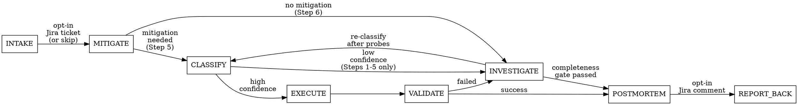

# Stage Flow — Graph

Read for the whole stage graph at a glance; the re-entry paths and the Step Sequence that state its transitions stay in `SKILL.md`. Moved verbatim from `SKILL.md`.

```dot
digraph stages {
    rankdir=LR;
    node [shape=box];
    INTAKE -> MITIGATE [label="opt-in\nJira ticket\n(or skip)"];
    MITIGATE -> CLASSIFY [label="mitigation\nneeded\n(Step 5)"];
    MITIGATE -> INVESTIGATE [label="no mitigation\n(Step 6)"];
    CLASSIFY -> EXECUTE [label="high\nconfidence"];
    CLASSIFY -> INVESTIGATE [label="low\nconfidence\n(Steps 1-5 only)"];
    INVESTIGATE -> CLASSIFY [label="re-classify\nafter probes"];
    INVESTIGATE -> POSTMORTEM [label="completeness\ngate passed"];
    EXECUTE -> VALIDATE;
    VALIDATE -> POSTMORTEM [label="success"];
    VALIDATE -> INVESTIGATE [label="failed"];
    POSTMORTEM -> REPORT_BACK [label="opt-in\nJira comment"];
}
```
